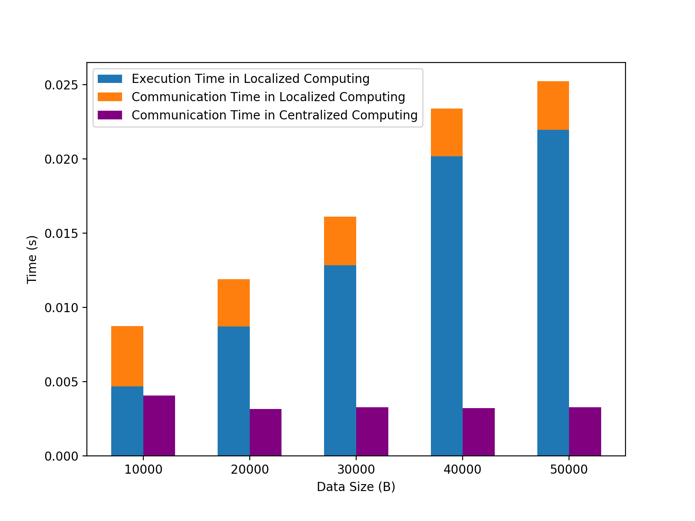
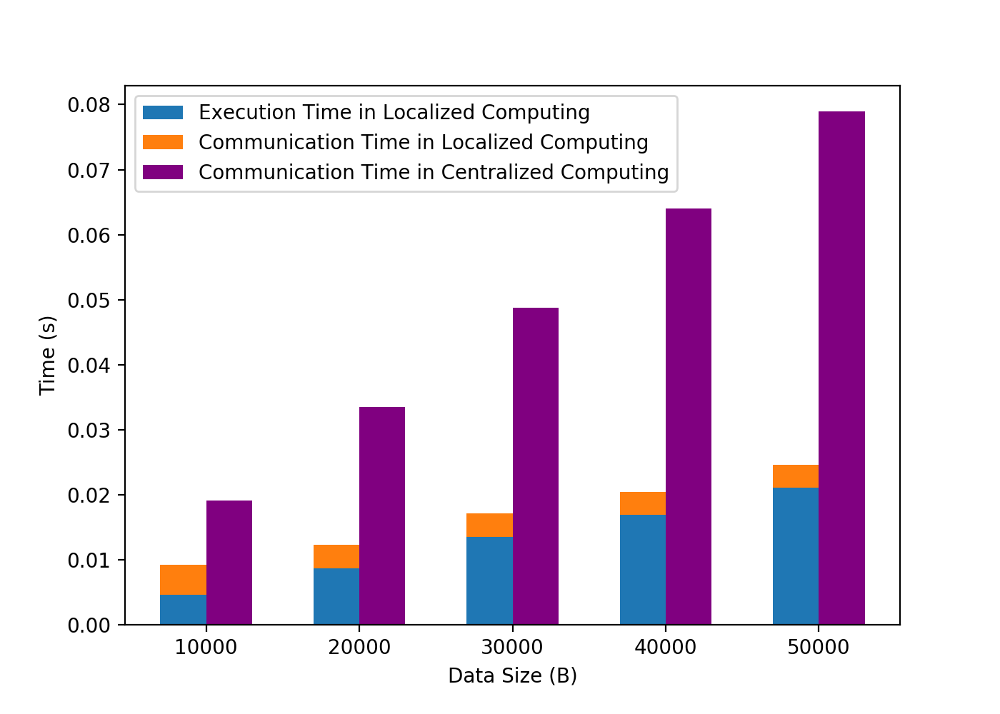
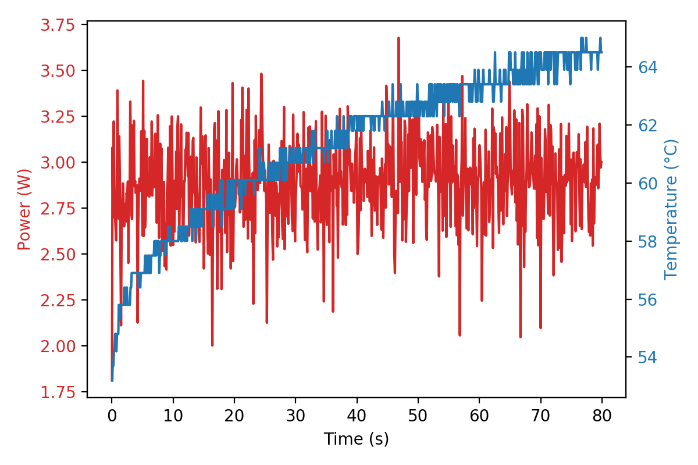

# Set up Hardware-in-the-Loop in ns-3

This tutorial introduces the setup procedure to integrate a hardware in ns-3 simulation environment. [ns-3](https://www.nsnam.org/) is a popular discrete-event network simulator. It features a rich selection of communication model and protocols. Integrating hardware systems (e.g. mobile systems, Raspberry Pi) into ns-3 can test real application code, obtain real-time readings of power/performance/temperature while save much effort in setting up the communication medium.

## Overview of Hardware-in-the-Loop

The setup in this tutorial is adapted from ns-3's TapBridge examples, as shown below.

```
 *     +---------+
 *     |  Linux  |                             +----------+
 *     | ------- |                             |   ghost  |
 *     |  apps   |                             |   node   |
 *     | ------- |                             | -------- |
 *     |  stack  |                             |    IP    |     +----------+
 *     | ------- | +--------+                  |   stack  |     |   node   |
 *     | Virtual | |  TAP   |                  |==========|     | -------- |
 *     | Device  | | Device | <---- IPC -----> |   tap    |     |    IP    |
 *     +---------+ +--------+                  |  bridge  |     |   stack  |
 *         ||          ||                      | -------- |     | -------- |
 *     +--------------------+                  |   ns-3   |     |   ns-3   |
 *     | OS (brctl) Bridge  |                  |   net    |     |   net    |
 *     +--------------------+                  |  device  |     |  device  |
 *                                             +----------+     +----------+
 *                                                  ||               ||
 *                                             +---------------------------+
 *                                             |        ns-3 channel       |
 *                                             +---------------------------+
```

I tried setting up CSMA LAN and Wi-Fi as ns-3 channel. According to ns-3's [official explaination on Tap Bridge Model](https://www.nsnam.org/docs/release/3.9/doxygen/group___tap_bridge_model.html), nodes on CSMA channel can use TapBridge UseBridge mode, while wireless STA nodes have to use TapBridge UseLocal mode.

There are four components required to connect external Linux-based system to ns-3. These four components should be connected one-by-one in a chain. I will explain them in an order from external system to ns-3 environment.

* **External Linux system.** This is the hardware system to include in the loop, which is a Raspberry Pi in our setup. I will use Pi to refer to this hardware piece. The rest configurations and ns-3 environment is running on another host. Our host is a Linux desktop. Pi and host are connected through an Ethernet cable. Therefore, we need to set a static IP for the Ethernet interface on the Pi. 
* **OS Bridge configured by [`brctl`](https://linux.die.net/man/8/brctl) tool.** Software bridge is a piece of software that glues up two network interfaces. In this way, packets arriving at one interface will be forwarded to the other one, which makes a separate computer feel like it joins a larger network. In our case, we use the bridge to fuse `eth0` and `tap0`.
* **Tap Interface configured by [`tunctl`](https://linux.die.net/man/8/tunctl) tool.** Tap interfaces are virtual Ethernet interfaces that do not have any physical device associated with them. In our case, these virtual interfaces act as entry and exit points for the traffic going to and coming from the simulations. The Tap interfaces would appear to the Linux host as if they are real interfaces connected to it. 
* **TapBridge Module in ns-3.** TapBridge is a module that can be installed on a ns-3 node, as shown above. It provides a mechanism for exchanging packets between ns-3 simulation and the host. Specifically, when the traffic is sent from the host to a Tap interface, it is received by the TapBridge that transforms the arriving real packets to simulated packets by making a write operation inside the ns-3 simulation. On the other hand, when the TapBridge receives the simulated packets from the ns-3 simulation, it transforms the arriving simulated packets to real packets by making a write operation on the tap interface.
  TapBridge can be installed on a **ghost node**, as shown in the above diagram. Note that the ghost node does not carry any practical workload in the simulation. The only job is to hold TapBridge and make the real device appear on the virtual ns-3 channel.

## Environment Setup

* Install package `uml-utilities` and `bridge-utilities` to use `tunctl` and `brctl` on host.

  ```shell
  sudo apt-get install uml-utilities bridge-utilities
  ```

* I create a script for easily setting and resetting bridges on host. `cd` into the `scripts` folder, and run the following commands:

  ```shell
  # To set the bridge on host
  sudo bash ./br-set.sh set
  # To reset the bridge on host
  sudo bash ./br-set.sh reset
  ```

* To set a static IP on the Pi, add the following content into `/etc/dhcpcd.conf`. Note that the Pi needs to be on the same network as the other nodes in ns-3. When we set its IP to `10.1.1.5`, we have four other virutal nodes in the ns-3 simulation, ranging from `10.1.1.1` to `10.1.1.4`.

  ```
  interface eth0
  static ip_address=10.1.1.5/24
  static routers=10.1.1.1
  static domain_name_servers=10.1.1.1
  ```

* Copy the all codes in the `scripts` folder except `br-set.sh` to the Pi. 

## Run the Experiment

* On Pi side, start `udp-server.py`. Other scripts are imported or used by `udp-server.py`.

  ```shell
  sudo python3 udp-server.py
  ```

* On the host, start ns-3 simulation scripts `hil-tap-csma.cc` or `hil-tap-wifi.cc`. Suppose you put both files under `ns-allinone-3.27/ns-3.27/scratch/`. After building sucessfully, you should be able to run these applications with the following commands in the `ns-allinone-3.27/ns-3.27/` directory:

  ```shell
  sudo ./waf --run "hil-tap-wifi"
  sudo ./waf --run "hil-tap-csma"
  ```

* You can use `ping` test to make sure that you have established the connection sucessfully. Basically, you should be able to successfully `ping` the IP address from `10.1.1.1` to `10.1.1.5` on both host and Pi. In other words, all virtual node and the Pi seem to be real devices connect to the local network of `10.1.1`.

## Test Results

With `hil-tap-wifi.cc`, I conduct a simple experiment to collect real power/performance/temperature readings from Pi while simulate network delay in ns-3. I try to observe the situation under *Centralized Computing* scheme vs. *Localized Computing* scheme. The former one send all data to the cloud (i.e. a central server) while the latter one runs Linear Regression to process data locally before sending the generated results to cloud. To demonstrate the trade-off between those two schemes, I analyze the delay decomposition under different network condition. The results are shown in the following.





It can be observed that, under bad network condition, *Localized Computing* saves both time and energy. Note that a portion of the result is measured on real devices while the other portion comes from simulation results of ns-3. The above results show that delay measurement can be combined with simulated results for performance trade-offs in ns-3.

Besides, actual readings of power and temperature on Pi can also be requested and recorded in ns-3.



## File Structure

```c
.
├── README.md
├── hil-tap-csma.cc              // csma demo
├── hil-tap-wifi.cc						   // wifi demo
├── result
│   ├── badnet.png							 // generated plots from plot.ipynb
│   ├── goodnet.png							 // generated plots from plot.ipynb
│   ├── log-badnet-comp.txt      // original logs of time, bad network, local computing
│   ├── log-badnet-send.txt      // original logs of time, bad network, central computing
│   ├── log-goodnet-comp.txt     // original logs of time, good network, local computing
│   ├── log-goodnet-send.txt     // original logs of time, good network, central computing
│   ├── plot.ipynb               // jupyter notebook for ploting
│   ├── plot.py                  // generated script from plot.ipynb
│   ├── power.txt                // original logs of power
│   ├── pwr_temp.png             // generated plots from plot.ipynb
│   └── temp.txt                 // original logs of temperature
└── scripts
    ├── br-set.sh                // scripts for setting up bridges on host
    ├── get_temp.sh              // scripts for getting temperature readings on Pi
    ├── ina219_pi_seelab.py      // scripts for getting power readings on Pi with INA219
    ├── lr.py                    // simple linear regression scripts
    ├── udp-client.py            // simple udp client demo, not used in experiment
    └── udp-server.py            // udp server demo, used in experiment
```

## Resources

[ns-3 Tap Bridge Model](https://www.nsnam.org/docs/release/3.9/doxygen/group___tap_bridge_model.html).

[ns3::TapBridge Class Reference](https://www.nsnam.org/doxygen/classns3_1_1_tap_bridge.html).